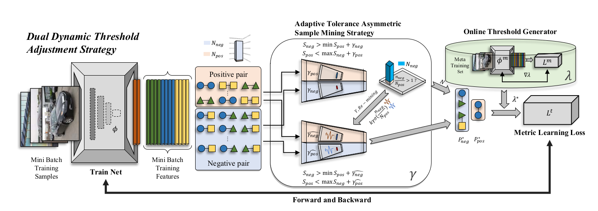

## Dual Dynamic Threshold Adjustment Strategy
This repository contains the official PyTorch implementation of the paper: **Dual Dynamic Threshold Adjustment Strategy**


Introduction
---
We propose a new metric learning method, Dual Dynamic Threshold Adjustment Strategy (DDTAS). 
The algorithm consists of two modules that deal with thresholds. Adaptive Tolerance Asymmetric Sample Mining Strategy (AT-ASMS) is used to select sample pairs precisely and adaptively. The loss function threshold adjustment algorithm is used to adjust the threshold in the deep metric learning loss function.
This repository contains datasets and source code to show the performance of our paper **Dual Dynamic Threshold Adjustment Strategy**


Framework
---
- **DDTAS** framework contains two modules:

    - (1)  Adaptive Tolerance Asymmetric Sample Mining Strategy (AT-ASMS);
    - (2) Online Threshold Generator (i.e. Loss function threshold adjustment modules).



Requirements
---
   - For the ease of reproducibility, you are suggested to install [anaconda](https://www.anaconda.com/distribution/) before following executing the following commands. 
   
```bash
conda create -y -n DDTAS python=3.7 (version>=3.5)
source activate ddtas
conda install -y pytorch cudatoolkit=10.1 -c pytorch
```
   - The batch-size=80 assumes your have a graphics card with 10GB video memory,e,g NVIDIA GeForce RTX 1080Ti. When only AT-ASMS is used, the algorithm requires fewer computing resources.


How to use
---
The code is currently tested only on GPU.
- Data Preparation
  
    Download dataset and checkpoint into working directory and decompress them 
    
    **DataSets**
    - [Car-196](http://ai.stanford.edu/~jkrause/cars/car_devkit.tgz)
    - [CUB-200-2011](http://www.vision.caltech.edu/visipedia-data/CUB-200/images.tgz)
    - [Stanford-Online-Products](ftp://cs.stanford.edu/cs/cvgl/Stanford_Online_Products.zip)

- Source Code Details
    
    - If you want to train the model using the source code, please follow the subsequent steps.
    
        - 1）Build a project document named `e.g.,DDTAS`, and put our code in it.
        - 2）Download dataset of `Dataset`/`CUB_200_2011(Cars196,Products)` into the working directory as needed.
        - 3）Use the command `cd DDTAS` to enter the DDTAS project.
        - 4）Use the command `Run_DDTAS.sh` to run examples.
        - 5）Description of these `.sh` files.
            - **Run_DDTAS.sh ** &nbsp;&nbsp;&nbsp;&nbsp; **#Core Command** 
               - Complete training presentation by DDTAS + Soft Contrastive Loss CUB200 and Cars-196
            - `Run_DDTAS.sh` and `Run_DDTAS_SOP.sh`
               - Complete training process by DDTAS on CUB200, Cars-196 and SOP.
            - For the above `Run_DDTAS.sh`
              - modify `CUDA_VISIBLE_DEVICES` to proper cuda device id.
              - modify `OTG` to control Online Threshold Generator the on and off with `1` and `0`.
              - modify `DATA` to the desired dataset.


Code Structure
---

```bash
########################### Data ###########################
DataSet/                        # default folder for placing CUB-200-2011 Cars-196 and SOP datasets
    Cars|SOP|CUB200.py          # Load datasets and, where CUB200.py & transforms.py
                                  contains transformer for input images
####################### Evaluations ########################
evaluations/
    recall_at_k.py               # script for Recall@K(%) evaluation
    extract_featrure.py|cnn.py   # compute pairwise distance and extract features

########################### Loss ###########################
losses/

----------------- Soft Contrastive -----------------
     SoftCon.py                       # Multi-Similarity loss with AT-ASMS and ASMS
#################### Pretrain and Backbone ##################
models/
                                 
    # modify your pretrain model absolute path in backbone files
     BN_Inception.py             # routine training network
     meta_layers.py              # define the Meta-Net layer for online threshold generator
     bn_inception-52deb4733.pth  # pre-trained on ImageNet

########################### Utils ###########################
                       misc functions
utils/ 
     args.py                     # set the default value of arguments
     ckptest.py                  # (1)test the effect of the pretraining model before training
                                 # (2)test the effect of the saved checkpoint during training
     model_load.py               # modify absolute path here
                                   
     HyperparamterDisplay.py     # print important parameters before training
     plot.py                     # use for drawing R@1 and loss variation diagrams
     sampler.py                  # contain K-P sampling function
     
########################### Train ###########################

--------------------- DDTAS + DML Loss ----------------------

     DDTAS_train.py               # script for training the neural network with DDTAS framework (CUB200 Cars-196)
     DDTAS_train_SOP.py           # script for training the neural network with DDTAS framework (finetune SOP)
     trainer_DDTAS.py             # DDTAS FRAMEWORK
     trainer_DDTAS_SOP.py         # DDTAS FRAMEWORK


```


